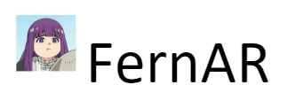
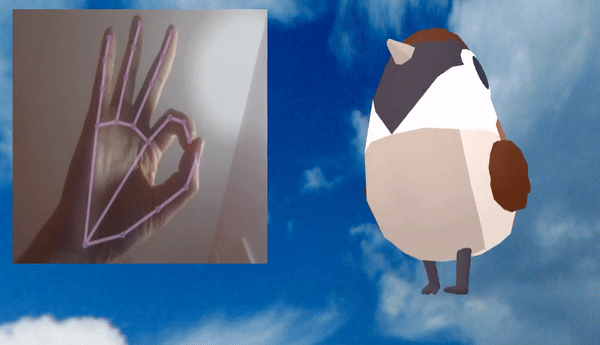
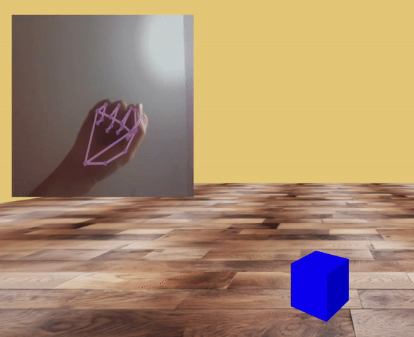
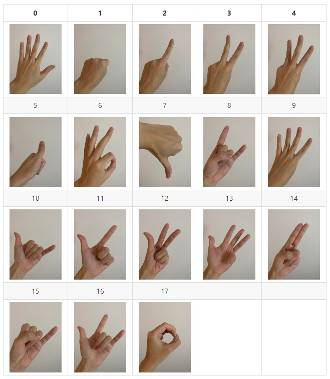

<h1 align="left"></h1>

<p align="center">
    </p>

<p align="center"><b>Web Augmented Reality. A-Frame Component. Currently supports gesture recognition</b></p>

<p align="center">
  <a href="https://npmjs.org/package/fern-ar">
    
  </a>
  <a href="https://npmjs.org/package/fern-ar">
    
  </a>
  <a href="https://npmjs.com/package/fern-ar">
    </a>
  </a>
  <a href="https://www.jsdelivr.com/package/npm/fern-ar">
    </a>
  </a>
</p>

## **Feature**

:pushpin: **Gesture Recognition A-Frame Component**: Capable of recognizing 18 gestures.

:pushpin: **Custom Gesture Training**: Train personalized models and pass them to the FernAR engine for customized gesture recognition.

## **Gesture Recognition**:
Place the library into a scene to initiate an AR scene using the device camera. This allows you to use gestures for controlling A-Frame elements. If the library's predefined gestures are insufficient, you can explore the [Train Your Own Model](#train-your-own-model) section to train a custom model.

## **Simple Example**:

Live demo: [Enter AR](https://rylanpeng.github.io/fern-ar-js/gesture-recognition-playground/ascene.html)

```html
<html>
  <head>
    <meta name="viewport" content="width=device-width, initial-scale=1" />
    <script src="https://aframe.io/releases/1.5.0/aframe.min.js"></script>
    <script src="https://unpkg.com/aframe-event-set-component@5.0.0/dist/aframe-event-set-component.min.js"></script>
    <script src="https://cdn.jsdelivr.net/npm/fern-ar@1.0.0/dist/fernar-gesture.prod.js"></script>
  </head>
  <body>
    <a-scene fernar-gesture="drawLandmarker:true">
      <a-camera active="true" position="0 0 0"></a-camera>
      <a-box
        id="coolbox"
        fernar-gesture-target="gesture: 0,1,2"
        event-set__red="_event: fernar-gesture-event-0; material.color: red"
        event-set__blue="_event: fernar-gesture-event-1; material.color: blue"
        event-set__green="_event: fernar-gesture-event-2; material.color: green"
        color="yellow"
        position="0 0 -10"
      ></a-box>
    </a-scene>
  </body>
</html>
```

### **Step 1: Add fern-ar library**

#### CDN 

```html
<script src="https://cdn.jsdelivr.net/npm/fern-ar@latest/dist/fernar-gesture.prod.js"></script>
```

####  NPM 
```cmd
$ npm install fern-ar@latest
```

### **Step 2: Add `fernar-gesture` to `<a-scene>`**

```css
<a-scene fernar-gesture>
```

#### Note 1: For using self-training ML model, utilize the `FERNAR.updateModel` function with JSON (string), weights (array), and weight bin file name. 

- Refer to the example [self-training-model](./example/self-training-model.html) for more details.

```js
async function initializeScene() {
    const jsonModelPath = "../test-model/model.json";
    const binModelPath = "../test-model/model.weights.bin";

    // Fetching JSON model file
    const jsonResponse = await fetch(jsonModelPath);
    const jsonModelFile = await jsonResponse.text();

    // Fetching binary model file
    const binResponse = await fetch(binModelPath);
    const binModelFile = new Uint8Array(await binResponse.arrayBuffer());

    await FERNAR.updateModel(jsonModelFile, binModelFile, binModelPath);
}
initializeScene();
```

#### Note 2: Use `FERNAR.setDebugMode` to enable debug messages

```js
FERNAR.setDebugMode(true);
```

#### Note 3: Properties for `fernar-gesture`

| Property | Type | default |
| -------- | -------- | -------- |
| drawLandmarker | boolean | true |
| threshold | int | 10 |
| confidence | number | 0.7 |
| planePosition | array | -6 3 -7 |
| planeWidth | int | 5 |
| planeHeight | int | 5 |

### **Step 3: Add a camera to `<a-scene>`**

```html
<a-scene fernar-gesture="drawLandmarker:true">
  <a-camera active="true" position="0 0 0"></a-camera>
</a-scene>
```

### **Step 4: Register entities for gesture events**

Instruct FernAR to register the entity for gesture events by adding `fernar-gesture-target` to the entity and specifying an array of gesture IDs the entity should listen to. The event name would be `fernar-gesture-event-${gesture-id}`.

For example, by using `<a-box fernar-gesture-target="gesture: 1,2,5"></a-box>`, the FernAR engine will send **fernar-gesture-event-1**, **fernar-gesture-event-2**, and **fernar-gesture-event-5** events to the `<a-box>` every time the engine detects the corresponding gesture.

### **Step 4: Listen to the event from FernAR engine and perform desired actions**

```js
entity.addEventListener("fernar-gesture-event-0", function (event) {
     ...
});
```
    
## **Supported Gestures**:




## **Train Your Own Model**:

Refer to this Git page [Train Model](https://rylanpeng.github.io/fern-ar-js/train-model/label.html) to train a customized model. Provide a CSV file (you can use the one in **data/label.csv**), enter the new gesture ID you want to recognize, and perferm the gesture in front of the camera. The web pages will record the gesture landmark every time you click `Store Gesture`. 

After labeling, you can either click the `Download CSV File` button to download the new labeling CSV file or specify the total number of gestures you want to train (ex: gestures 0,1,2,3 would be total 4 gestures) and click `Start Training` to train the model using the CSV file you just labeled.

Once the training is complete, the web pages will automatically save the model in your device's Download folder. You should find two files: model.json and model.weight.bin.

## **Contributing**

Any support or questions are welcome! If you encounter any bugs or have suggestions for improvements, please feel free to open issues, and let's discuss them together.

## **Reference**:
:star: The gesture recognition heavily relies on the repo [hand-gesture-recognition-using-mediapipe](https://github.com/Kazuhito00/hand-gesture-recognition-using-mediapipe)

:star: A-Frame: https://github.com/aframevr/aframe

:star: MediaPipe: https://developers.google.com/mediapipe/solutions/vision/hand_landmarker

:star: Mind AR: https://github.com/hiukim/mind-ar-js
